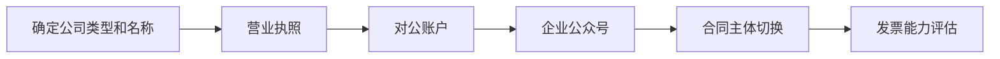

# 元晟传媒公司注册路线图

> 版本：2026-07-06  
> 策略：7-8 月暂不注册，先靠渠道单 + 个人收款跑现金流；8 月后按触发条件推进注册。

---

## 1. 为什么延后注册

当前状态：

- Howard + Brian出租屋双人办公
- 通过朋友广告公司接零散业务，已有收费案例
- 自媒体账号尚未开通
- 月现金流尚未稳定

7 月优先事项是跑通报价、案例、自媒体，而非行政手续。注册不应阻塞现金流执行。

---

## 2. 注册触发条件（满足任一即启动）

| 条件 | 说明 |
| --- | --- |
| 月净流入稳定 | 连续 2 个月净流入 ≥ 8000 元 |
| 需对公收款 | 客户明确要求对公账户或发票 |
| 需企业公众号 | 长文信任沉淀需要企业认证公众号 |
| 需签合同主体 | 客户要求与公司主体签约 |
| 多淼联合项目放大 | 联合项目需明确法人主体承担现场风险 |

未触发前：继续个人收款 + 渠道结算，不在自媒体公开承诺发票。

---

## 3. 注册后 30 天事项

| 阶段 | 时间 | 事项 | 负责人 |
| --- | --- | --- | --- |
| 准备 | 第 1-3 天 | 确定公司类型（个体工商户 vs 有限责任公司）、经营范围、注册地址 | Howard |
| 注册 | 第 4-10 天 | 提交工商注册、领取营业执照 | Howard |
| 财务 | 第 11-15 天 | 开设对公账户、确认税务登记 | Howard |
| 品牌 | 第 16-20 天 | 企业微信公众号认证、更新自媒体账号主体信息 | Brian |
| 合同 | 第 21-25 天 | 服务协议切换为公司主体、更新报价图和介绍页 | Howard |
| 发票 | 第 26-30 天 | 评估小规模纳税人 / 代开发票方案，更新 SOP | Howard |

---

## 4. 注册前 vs 注册后对比

| 事项 | 注册前（7-8 月） | 注册后 |
| --- | --- | --- |
| 收款 | 个人微信 / 支付宝 | 对公账户 + 个人备用 |
| 合同 | 个人服务协议 | 公司服务合同 |
| 发票 | 不提供 | 按税务方案提供 |
| 公众号 | 延后，用小红书替代 | 企业公众号认证 |
| 闲鱼 | 个人账号 | 可评估企业店铺 |
| 案例署名 | 元晟传媒 团队 | 元晟传媒（公司全称） |

---

## 5. 经营范围建议

注册时经营范围建议包含：

- 广告设计、代理、发布
- 品牌策划、企业形象策划
- 图文设计、制作
- 专业设计服务
- 市场营销策划

具体以当地工商要求为准。

---

## 6. 费用预估

| 项目 | 预估费用 |
| --- | --- |
| 个体工商户注册 | 0-500 元（代办费视地区） |
| 有限责任公司注册 | 500-2000 元（含代办） |
| 对公账户年费 | 0-500 元 / 年 |
| 企业公众号认证 | 300 元 / 年 |
| 代理记账（如需要） | 200-500 元 / 月 |

---

## 7. 不影响 7 月执行的原则

- 注册讨论不占用工作日白天时段，只在月度复盘时评估
- 不因等待注册而推迟自媒体账号开通（先用个人创作者账号）
- 不因无公司而降低报价或交付标准
- 渠道单和直客单继续正常推进

---

## 8. 8 月复盘检查项

月底复盘时勾选：

- [ ] 本月净流入是否达到触发条件？
- [ ] 是否有客户因无公司主体而流失？
- [ ] 是否已有客户要求发票？
- [ ] 小红书内容是否已积累到需要公众号承接？
- [ ] 多淼联合项目是否需明确法人主体？

若 3 项以上为「是」，9 月启动注册流程。
